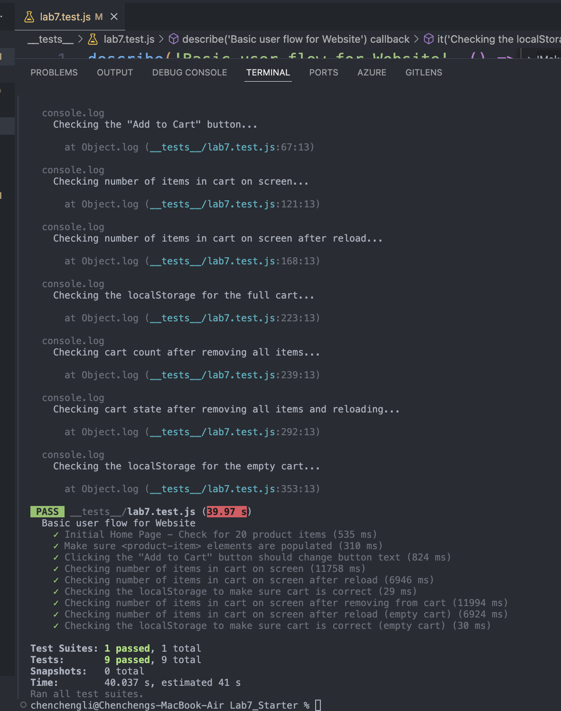

# Lab 7 - Unit & E2E Testing

**Name:** Chencheng Li

## Brief Introduction

This lab focuses on End-to-End (E2E) testing for a mock e-commerce web application. We used Jest as the testing framework and Puppeteer to control the browser and simulate user interactions. The goal was to write a series of tests to cover the basic user workflow of the website, including adding items to the cart, checking cart status, and verifying data persistence in `localStorage`.

## Check Your Understanding

**1) Where would you fit your automated tests in your Recipe project development pipeline? Select one of the following and explain why.**

*   **Selected Option:** 1. Within a Github action that runs whenever code is pushed.
*   **Explanation:**
    Automated tests, including End-to-End tests, are best integrated into the development pipeline through a CI/CD (Continuous Integration/Continuous Deployment) tool, such as GitHub Actions. This approach offers several key benefits:
    *   **Automation & Consistency:** Tests are run automatically every time code is pushed (especially to main branches or before merges), ensuring that testing is not forgotten and is performed consistently for all changes.
    *   **Early Feedback:** If a code change breaks existing functionality or introduces a bug in the user workflow, the automated tests will fail quickly. This provides immediate feedback to the developers, allowing them to address the issue promptly while the context is still fresh.
    *   **Improved Code Quality & Stability:** By catching regressions and bugs early, automated tests act as a safety net, preventing faulty code from being merged into the main codebase or deployed to production. This significantly improves the overall quality and stability of the software.
    *   **Team Collaboration:** In a team environment, automated tests ensure that contributions from different members integrate smoothly and do not negatively impact the application's core functionalities.

    Manually running tests locally (Option 2) is prone to human error and inconsistency. Running tests only after all development is completed (Option 3) is highly risky, as it can lead to discovering major issues late in the development cycle, making them much harder and more costly to fix.

**2) Would you use an end to end test to check if a function is returning the correct output? (yes/no)**

*   **Answer:** No.
*   **Explanation:**
    End-to-End (E2E) tests are designed to simulate real user scenarios and verify the flow of an application from start to finish, ensuring that all integrated components (like the UI, backend services, databases, etc.) work together correctly.
    To check if a specific function is returning the correct output, **Unit Tests** are more appropriate. Unit tests focus on testing individual, isolated pieces of code (like a single function or method) in detail to ensure they perform their specific task correctly. E2E tests are higher-level and cover broader functionality; using them to check a single function's return value would be inefficient and not their primary purpose.

**3) What is the difference between navigation and snapshot mode? (Lighthouse)**

*   **Navigation Mode:** This mode analyzes a page right after it loads. It provides an overall performance metric for the initial page load experience (like how quickly the page becomes interactive). However, it doesn't analyze user interactions or changes in content that happen *after* the initial load. It's good for a baseline understanding of load performance.

*   **Snapshot Mode:** This mode analyzes a page in its *current state* when the audit is run. It's best used for finding accessibility issues or issues in a single-page application after some interaction has occurred and the view has changed. It doesn't analyze the loading process itself, nor can it typically analyze JavaScript performance or changes to the DOM tree over a period of time (which Timespan mode is better for).

**4) Name three things we could do to improve the CSE 110 shop site based on the Lighthouse results.**
*   **Answer:**
    Based on the Lighthouse report for the CSE 110 shop site, here are three potential areas for improvement:

    1.  **Optimize Image Sizing (Properly size images):** The report indicated that serving appropriately-sized images could lead to significant data savings (e.g., a potential saving of 518 KiB was noted). This involves resizing images to match their display dimensions on the page more closely, rather than serving large original images and scaling them down with HTML/CSS. Implementing responsive images using `srcset` or the `<picture>` element would also be beneficial.

    2.  **Serve Images in Next-Generation Formats (Serve images in next-gen formats):** Lighthouse suggested that using modern image formats like WebP or AVIF could further reduce file sizes (e.g., a potential saving of 165 KiB). Converting existing JPEG/PNG images to WebP, while providing fallbacks for older browsers using the `<picture>` element, would improve load times and reduce data consumption.

    3.  **Reduce Unused CSS (Reduce unused CSS):** The report identified unused CSS rules that could be removed to save data (e.g., a potential saving of 19 KiB, possibly from frameworks like Pico.css). To address this, one could use tools like PurgeCSS to automatically remove unused styles from the final CSS files or ensure that only necessary components of a CSS framework are imported. Deferring non-critical CSS could also improve initial page render time.

## Test Results Screenshot

